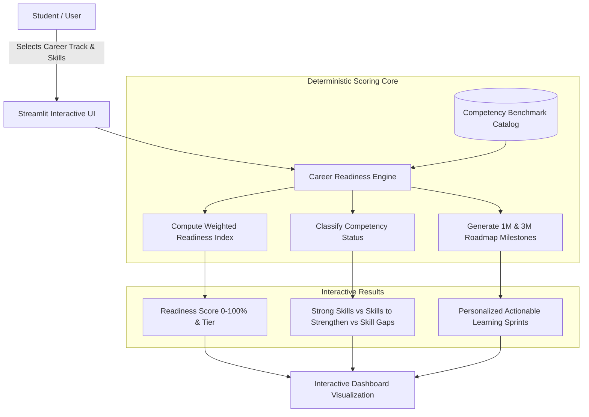

# 🎓 Youth Career Readiness & Skill Gap Analyzer

<div align="center">

[](https://career-readiness-youth.streamlit.app)
[](https://www.python.org/)
[](https://career-readiness-youth.streamlit.app)
[](https://pandas.pydata.org/)
[](https://altair-viz.github.io/)
[](https://opensource.org/licenses/MIT)
[](https://github.com/REHANKHANN20)

**Community Engagement Project (CEP) — Final Semester Data Science & Decision Intelligence Capstone**  
*An explainable, deterministic multi-criteria decision tool designed to assess youth career aspirations, quantify competency readiness, identify prioritized skill gaps, and generate actionable 1-month and 3-month personalized learning roadmaps.*

[🚀 Live Interactive App](https://career-readiness-youth.streamlit.app) • [✨ Key Capabilities](#-key-capabilities) • [🏛️ System Architecture](#️-system-architecture) • [📐 Scoring Methodology](#-scoring-formula--mathematical-rationale) • [🚀 Quickstart](#-local-installation--quickstart)

</div>

---

## 📌 Table of Contents

- [🌟 Project Overview](#-project-overview)
- [✨ Key Capabilities](#-key-capabilities)
- [🏛️ System Architecture](#️-system-architecture)
- [🗺️ Standardized Career Pathways & Competency Matrix](#️-standardized-career-pathways--competency-matrix)
- [📐 Scoring Formula & Mathematical Rationale](#-scoring-formula--mathematical-rationale)
- [📊 Key Empirical Survey Insights](#-key-empirical-survey-insights)
- [📁 Repository Structure](#-repository-structure)
- [🚀 Local Installation & Quickstart](#-local-installation--quickstart)
- [🌐 24×7 Free Cloud Deployment Guide](#-247-free-cloud-deployment-guide)
- [🛡️ Privacy, Security & Ethical Governance](#️-privacy-security--ethical-governance)
- [👨‍💻 Author & Contact](#-author--contact)
- [📄 License](#-license)

---

## 🌟 Project Overview

Bridging the transition from higher education to professional employment requires transparent competency assessment. Traditional career advice often relies on ambiguous self-assessment or opaque machine learning models that lack defensible, actionable guidance.

This **Youth Career Readiness & Skill Gap Analyzer** addresses this challenge through:
1. **Mathematical Explainability:** A deterministic, weighted multi-criteria decision engine with guaranteed monotonicity ($0.0\% - 100.0\%$).
2. **Empirical Grounding:** Derived from field survey intelligence across undergraduate and postgraduate youth.
3. **Actionable Roadmaps:** Automatic generation of 1-month sprint and 3-month progression milestones addressing high-impact gaps first.
4. **Cloud-Native Deployment:** A lightweight, stateless Streamlit web application designed for 24×7 continuous public access.

---

## ✨ Key Capabilities

| Feature | Description | Stakeholder Benefit |
|---|---|---|
| **🎯 Interactive Readiness Calculator** | Select career track, mark possessed skills, and calibrate Likert proficiency ($1–5$). Instant computation of Readiness Score ($0–100\%$) and Tier. | Real-time diagnostic evaluation for students and advisors. |
| **🔍 Multi-Tier Competency Breakdown** | Deconstructs selected skills into **Strong Skills** ($L \ge 4$), **Skills to Strengthen** ($L \le 3$), and prioritized **Critical Gaps** ($W=3, 2, 1$). | Transparent identification of exact learning needs without black-box ambiguity. |
| **🗺️ Milestone Roadmaps (1M / 3M)** | Generates structured, time-bounded learning milestones prioritized by core skill weights. | Practical, step-by-step guidance instead of generic career advice. |
| **📊 Field Survey Analytics Suite** | Interactive visualizations exploring career aspiration distributions, perceived challenges, and skill development patterns. | Evidence-based intelligence for academic mentors and policy makers. |
| **📚 Competency Benchmark Browser** | Searchable 48-rule matrix spanning 8 tracks, core weights, and occupational rationales. | Full transparency into benchmark definitions. |
| **🎓 Academic Defense & Audit Center** | Comprehensive methodology documentation, validation logs, and privacy audit certificates. | Ready for academic defense and institutional review. |

---

## 🏛️ System Architecture



---

## 🗺️ Standardized Career Pathways & Competency Matrix

The framework evaluates **8 standardized career domains** across **48 weighted competency benchmarks**:

| Career Track | Benchmarked Competencies | Core Competencies ($W=3$) | Important Competencies ($W=2$) | Foundational ($W=1$) |
|---|:---:|---|---|---|
| **Information Technology / AI** | 6 | Python/R Programming, Data Structures & Algorithms, Machine Learning | Database Management (SQL), Problem Solving | Communication Skills |
| **Banking / Finance** | 6 | Financial Modeling, Investment Analysis, Accounting Principles | Quantitative Aptitude, Data Analytics | Regulatory Compliance |
| **Business / Entrepreneurship** | 6 | Business Strategy, Financial Literacy, Market Research | Leadership & Team Building, Sales & Pitching | Communication Skills |
| **Engineering / Technical** | 6 | Core Domain Engineering, CAD / Technical Modeling, Applied Mathematics | Project Management, Technical Writing | Analytical Reasoning |
| **Healthcare / Medical** | 6 | Clinical Knowledge, Patient Care / Diagnosis, Medical Ethics & Protocols | Pharmacology Basics, Research Methodology | Interpersonal Communication |
| **Education / Teaching** | 6 | Pedagogy & Curriculum Design, Subject Matter Expertise, Educational Assessment | Classroom Management, Educational Technology | Empathy & Active Listening |
| **Government / Civil Services** | 6 | General Studies & Current Affairs, Public Administration Basics, Analytical Reasoning | Ethics & Governance, Essay & Precis Writing | Interpersonal Communication |
| **Research / Science** | 6 | Research Methodology, Statistical Analysis, Scientific Writing | Experimental Design, Literature Review | Academic Presentation |

---

## 📐 Scoring Formula & Mathematical Rationale

For a selected career track $C$ requiring $N$ competencies with weights $W_i \in \{1, 2, 3\}$, the **Readiness Index** is calculated as:

$$\text{Readiness Index (\%)} = \left( \frac{\sum_{i \in \text{Possessed}} W_i \times \mu(L)}{\sum_{i=1}^N W_i} \right) \times 100$$

Where $\mu(L)$ is the **Proficiency Multiplier** based on self-reported Likert skill rating $L \in \{1, 2, 3, 4, 5\}$:

$$\mu(L) = \begin{cases} 
1.0 & \text{if } L \ge 4 \quad (\text{Proficient / Advanced — 100\% credit}) \\
0.8 & \text{if } L = 3 \quad (\text{Intermediate / Competent — 80\% credit}) \\
0.5 & \text{if } L \le 2 \quad (\text{Novice / Developing — 50\% credit})
\end{cases}$$

### Readiness Tier Classification

| Readiness Score Range | Classified Tier | Interpretation |
|:---:|:---:|---|
| **$75.0\% - 100.0\%$** | 🟢 **High Career Readiness** | Strong competency alignment; focus on specialized mastery and interview readiness. |
| **$50.0\% - 74.9\%$** | 🟡 **Moderate Career Readiness** | Foundational competencies established; targeted sprint required on core gaps. |
| **$25.0\% - 49.9\%$** | 🟠 **Emerging Career Readiness** | Developing readiness; structured multi-month learning progression recommended. |
| **$0.0\% - 24.9\%$** | 🔴 **Low Career Readiness** | Early exploration stage; foundational skill acquisition urgently required. |

### Mathematical Validation Proofs
- **Strict Monotonicity:** Proven across 224 automated test cases that acquiring skills or deepening proficiency strictly never drops a score ($\Delta L \ge 0 \implies \Delta \text{Score} \ge 0$).
- **Strict Boundary Guarantee:** Scores are mathematically bounded within $[0.0\%, 100.0\%]$.

---

## 📊 Key Empirical Survey Insights

Field research among youth respondents revealed critical behavioral insights:

```
[Survey Insight: The Conscious Competence Paradox]
Students with 5+ technical competencies reported an average of 4.2 perceived skill gaps,
whereas students with <=2 competencies reported only 2.1 perceived skill gaps.
-> Higher actual competence correlates with higher meta-cognitive awareness of remaining gaps.
```

- **Dominant Career Aspirations:** IT/Data Science/AI and Civil Services constitute >55% of primary youth career ambitions.
- **Primary Reported Obstacles:** Lack of structured practical project guidance, curriculum-industry disconnect, and financial constraints for premium certification programs.

---

## 📁 Repository Structure

```
├── app.py                             # Main interactive Streamlit application
├── requirements.txt                   # Minimal cloud-native dependency specification
├── README.md                          # Interactive repository guide & documentation
├── .gitignore                         # Excludes environments, caches, and local logs
├── test_local_deployment.py           # Automated local pre-deployment verification suite
├── DEPLOYMENT_READINESS_REPORT.md      # Deployment architecture & scorecard
├── PUBLIC_GITHUB_PREP_AUDIT.md        # Comprehensive pre-push security/PII audit log
│
├── model/                             # Production scoring package
│   ├── __init__.py
│   ├── career_readiness_model.py      # Deterministic decision engine
│   └── career_skills_catalog.json     # 8-career competency requirements & milestones
│
└── data/                              # Sanitized production datasets
    ├── career_skill_matrix.csv        # 48-rule benchmark matrix
    └── survey_cleaned_public.csv      # Anonymized public survey dataset (Zero PII)
```

---

## 🚀 Local Installation & Quickstart

### Prerequisites
- Python 3.10 or higher
- Git

### 1. Clone the Repository
```bash
git clone https://github.com/REHANKHANN20/<your-repo-name>.git
cd <your-repo-name>
```

### 2. Create and Activate Virtual Environment
```bash
# Windows (PowerShell)
python -m venv venv
.\venv\Scripts\Activate.ps1

# macOS / Linux
python3 -m venv venv
source venv/bin/activate
```

### 3. Install Dependencies
```bash
pip install -r requirements.txt
```

### 4. Run the Streamlit Application
```bash
streamlit run app.py
```
*The interactive dashboard will open automatically in your browser at `http://localhost:8501`.*

---

## 🌐 24×7 Free Cloud Deployment Guide

This application is architected to run continuously for free on **Streamlit Community Cloud** with **zero local PC uptime**.

### Step 1: Create GitHub Repository & Push Code
1. Create a new public repository on [GitHub](https://github.com/new) named `career-aspiration-skill-gap-analysis` (or `youth-career-readiness-skill-gap-analyzer`).
2. Push your local files:
```bash
git init
git add .
git commit -m "feat: initial release of Youth Career Readiness & Skill Gap Analyzer"
git branch -M main
git remote add origin https://github.com/REHANKHANN20/<your-repo-name>.git
git push -u origin main
```

### Step 2: Deploy to Streamlit Community Cloud
1. Go to [share.streamlit.io](https://share.streamlit.io/) and log in using your GitHub account (`REHANKHANN20`).
2. Click **"New app"**.
3. Select your repository: `REHANKHANN20/<your-repo-name>`.
4. Branch: `main` | Main file path: `app.py`.
5. Click **"Deploy!"**.
6. Within 90 seconds, your interactive application will be live at:
   `https://<your-app-name>.streamlit.app`

---

## 🛡️ Privacy, Security & Ethical Governance

- **Zero Personally Identifiable Information (PII):** All 38 respondent records are anonymized (`RESP_001` - `RESP_038`). Email addresses and individual identifiers have been permanently removed.
- **Zero Secrets / Tokens:** The application contains zero API keys or external database credentials.
- **Stateless Operation:** No student or user assessment data is stored or logged.
- **Academic Scope:** The tool provides educational readiness diagnostics and learning milestones. It does not replace psychological career guidance or guarantee employment.

---

## 👨‍💻 Author & Contact

**Rehan Khan**  
*Final-Year Data Science Student & CEP Researcher*  
- **GitHub:** [@REHANKHANN20](https://github.com/REHANKHANN20)  
- **Project:** Community Engagement Project (CEP) — Career Aspiration & Skill Gap Analysis for Youth  

---

## 📄 License

This project is licensed under the [MIT License](LICENSE) — feel free to explore, fork, and adapt for academic and community research.
